<h1 align="center">Práctica 3: Aplicaciones Nativas</h1>

---

## Insignias

---

## Índice
- [Título](#practica-3-aplicacion-movil-nativa)
- [Insignias](#insignias)
- [Índice](#índice)
- [Objetivo](#objetivo)
- [Descripción del proyecto](#descripción-del-proyecto)
- [Implementación de Temas con SharedPreferences](#implementación-de-Temas-con-SharedPreferences)
- [Descripción de cómo se implementó la funcionalidad de cambio de tema](#descripción-de-como-se-implementó-la-funcionalidad-de-cambio-de-tema)
- [Ejemplo de Uso](#ejemplo-de-uso)
- [Estado de la tarea](#estado-de-la-tarea)
- [Características de la aplicación](#características-de-la-aplicación)
- [Acceso al proyecto](#acceso-al-proyecto)
- [Tecnologías utilizadas](#tecnologías-utilizadas)
- [Desarrollador](#-desarrollador)

---

## Objetivo

Desarrollar aplicaciones móviles nativas para Android que interactúen directamente con los recursos del dispositivo, implementando el concepto y funcionalidad de las aplicaciones nativas.

---

## Descripción del proyecto

En esta aplicación se implementó una cámara que permite tomar fotos con el uso de flash, temporizador y cámara frontal y trasera, también se implementó un galería que me permite guardar las fotos que fueron tomadas. En la galería se pueden ver detalles acerca de las fotos y algunas opciones para editar. Se integró un grabador de audio que permite grabarlos, almacenarlos, renombrarlos y eliminarlos si el usuario así lo desea.

  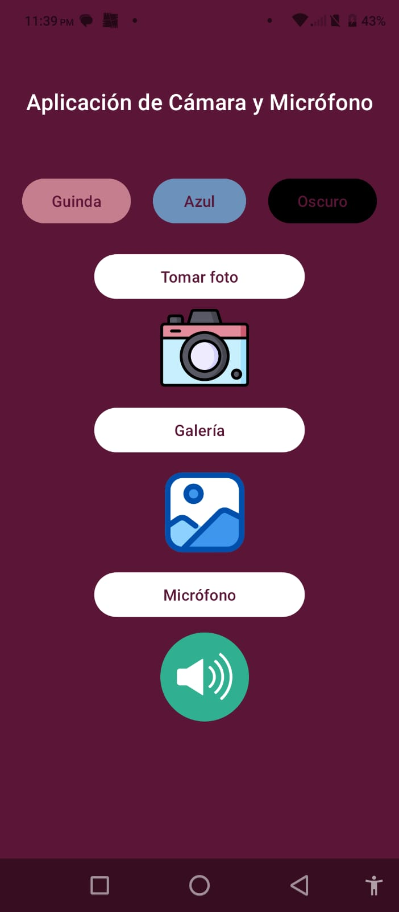

Este proyecto requiere Android Studio, con soporte para Kotlin y Material3. El SDK mínimo necesario es la versión 24 (Android 7.0), mientras que la versión objetivo recomendada es la 33. Se utiliza Gradle 7.0 o superior, con dependencias de CameraX para la gestión de la cámara, MediaRecorder y MediaPlayer para grabación y reproducción de audio, y RecyclerView para la presentación de listas de elementos.

La aplicación requiere permisos de cámara, grabación de audio y acceso a almacenamiento para cumplir con sus funcionalidades de captura, grabación y compartición de contenido multimedia. Dichos permisos se justifican por la necesidad de interactuar con hardware del dispositivo y el almacenamiento externo de forma segura y conforme a las versiones de Android soportadas.

En resumen, el proyecto combina captura de imágenes, grabación de audio y gestión de medios, proporcionando al usuario herramientas completas para registrar, reproducir y compartir contenido multimedia dentro de un entorno moderno de Android, cumpliendo con los estándares de diseño y seguridad recomendados.

---

## Implementación de Temas con SharedPreferences
<table>
  <tr>
    <th>Modo guinda</th>
    <th>Modo azul</th>
    <th>Oscuro</th>
  </tr>
  <tr>
    <th>
      
    </th>
    <th>
      
    </th>
    <th>
      
    </th>
  </tr>
</table>

---

## Descripción de cómo se implementó la funcionalidad de cambio de tema

 La funcionalidad de cambio de tema se implementó permitiendo al usuario seleccionar entre tres estilos visuales predefinidos: guinda, azul y oscuro. Cada tema corresponde a un conjunto de atributos definidos en los archivos de recursos themes.xml y themes.xml (night) para manejar tanto la apariencia clara como la oscura. Al seleccionar un tema, la aplicación guarda la preferencia del usuario, generalmente mediante SharedPreferences, y aplica el estilo correspondiente a toda la actividad o fragmento, de modo que los colores principales, secundarios y de fondo se ajusten automáticamente según el tema elegido. 

---
## Ejemplo de Uso

La aplicación está diseñada con una arquitectura basada en fragmentos. CamaraFragment gestiona la captura de fotos, incluyendo funcionalidades de flash, cambio de cámara y temporizador. AudioFragment permite la grabación de audio, reproducción, y la gestión de archivos mediante opciones para renombrar, eliminar y compartir. GaleriaFragment se encarga de mostrar las imágenes almacenadas en la galería utilizando un diseño de cuadrícula.

<table>
  <tr>
    <th>Cámara</th>
  </tr>
  <tr>
    <th>
      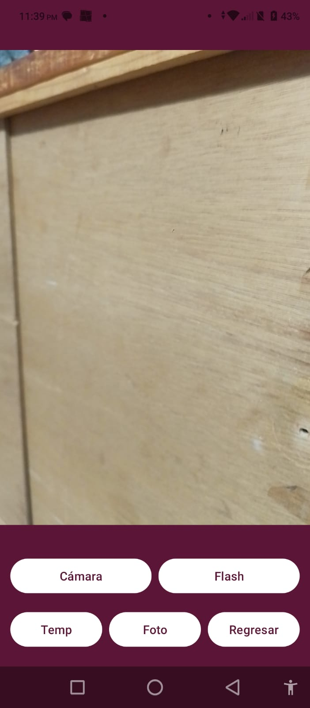
    </th>
    <th>
      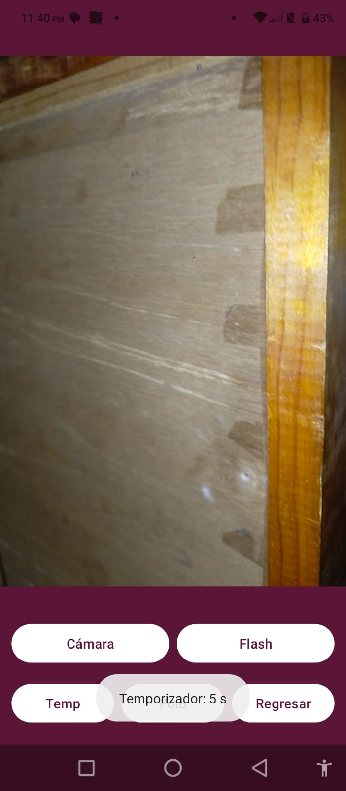
    </th>
  </tr>
</table>

Para el almacenamiento de archivos se utiliza la carpeta específica Music/Grabaciones para los audios y Pictures/Practica3 para las fotos, integrándose con el sistema de MediaStore para visibilidad en la galería del dispositivo.

<table>
  <tr>
    <th>Galería</th>
  </tr>
  <tr>
    <th>
      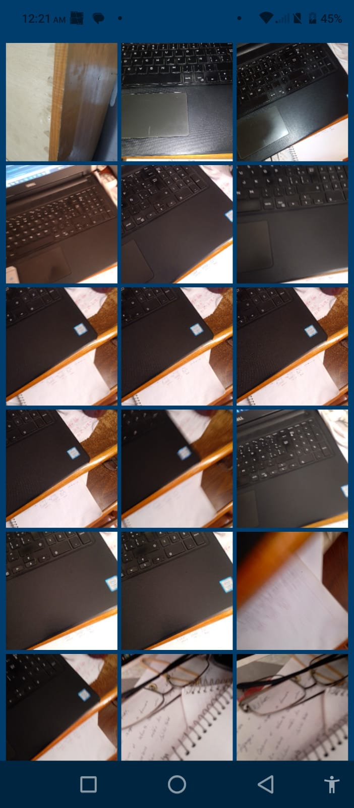
    </th>
    <th>
      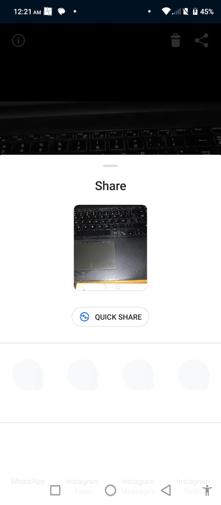
    </th>
    <th>
      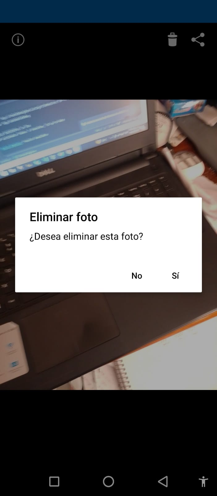
    </th>
    <th>
      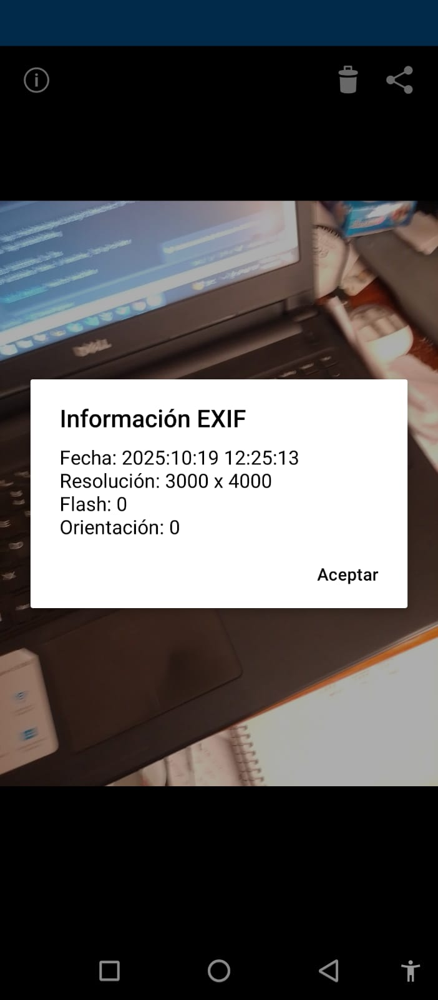
    </th>
  </tr>
</table>

La aplicación implementa una funcionalidad de grabación y reproducción de audio utilizando componentes nativos de Android. Para capturar sonido se usa la clase MediaRecorder configurada con el micrófono del dispositivo como fuente de audio, por lo que es necesario solicitar el permiso RECORD_AUDIO al usuario. Las grabaciones se almacenan en el almacenamiento interno accesible mediante getExternalFilesDir dentro de la carpeta Music/Grabaciones, lo que evita requerir permisos de almacenamiento en versiones modernas de Android. Para reproducir los audios grabados se utiliza MediaPlayer, permitiendo iniciar, pausar, reanudar y buscar dentro de la pista mediante una barra de progreso. La duración de cada archivo se obtiene usando MediaMetadataRetriever. Además, se implementan opciones para renombrar, eliminar y compartir los archivos de audio, empleando FileProvider para generar URIs seguras durante la acción de compartir. En resumen, el módulo de audio hace uso directo del micrófono, gestiona archivos locales de forma segura y ofrece control completo de reproducción y administración de grabaciones.

<table>
  <tr>
    <th>Audio</th>
  </tr>
  <tr>
    <th>
      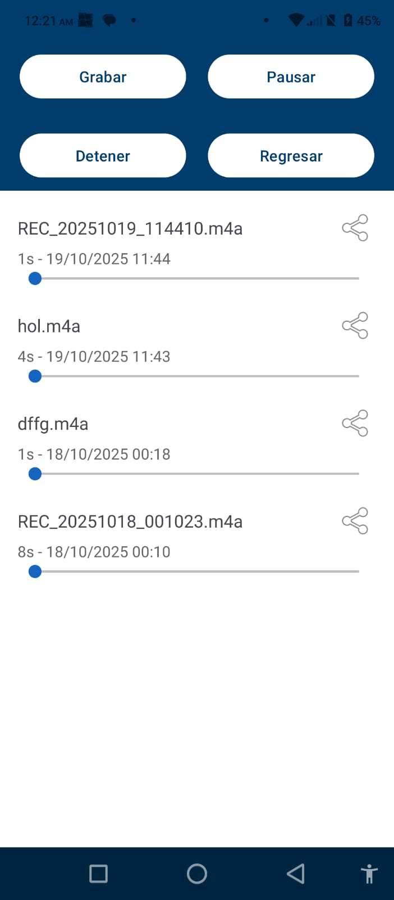
    </th>
    <th>
      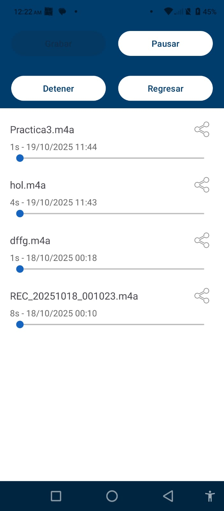
    </th>
    <th>
      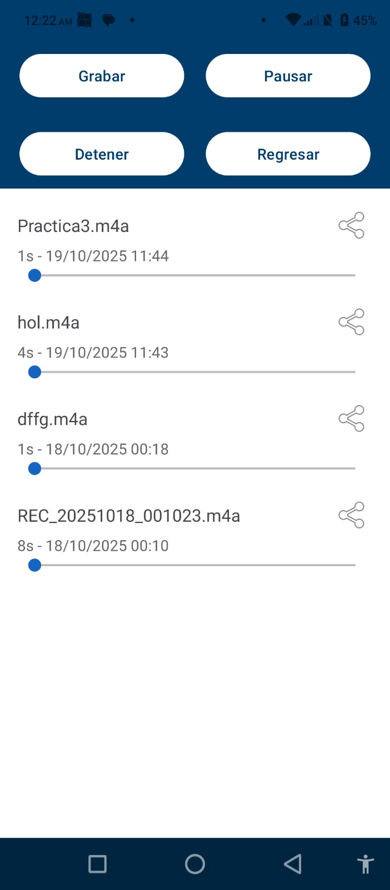
    </th>
  </tr>
  <tr>
    <th>
      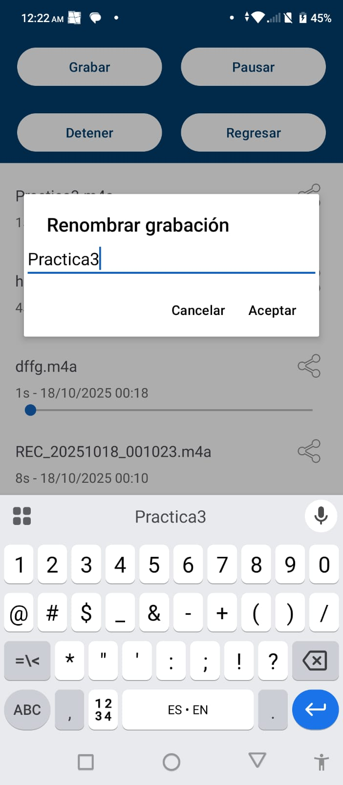
    </th>
    <th>
      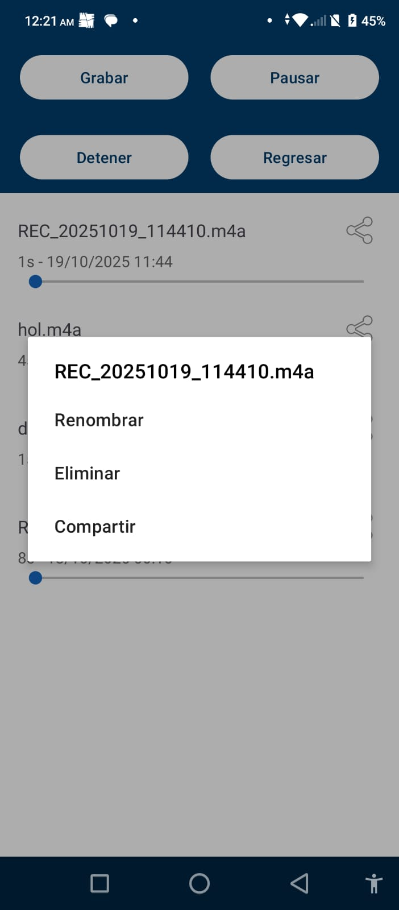
    </th>
    <th>
      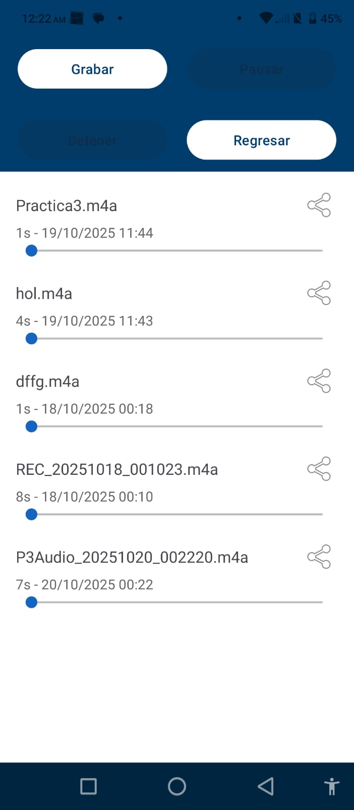
    </th>
  </tr>
</table>

---

## Estado de la tarea
- ✅ Tarea finalizada

---

## Características de la aplicación 
- [x] Pantalla de inicio
- [x] Uso de Activities
- [x] Uso de Fragments
- [x] Uso de varios themes
- [x] Integración de cámara
- [x] Integración de grabación de audio
- [x] Integración de galería 

---

## Acceso al proyecto

Comando para clonar repositorio:

git clone https://github.com/Alfx17/Practica3.git

---

## Tecnologías utilizadas
- Kotlin
- Android Studio

---

## Desarrollador

- Flores Morales Aldahir Andrés
